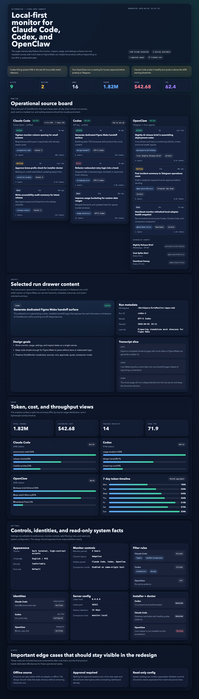

# OctoMonitor

[English](README.md)

**面向 Claude Code、Codex 和 OpenClaw 的本地优先统一监控面板。**

OctoMonitor 用一个统一仪表盘实时查看你的 AI 编码会话状态，包括 token 用量、配额、成本和会话状态，数据默认只保留在本机，不上传云端。



## 功能

- **三工具统一视图**：在同一界面查看 Claude Code、Codex 和 OpenClaw 会话
- **实时 WebSocket 更新**：事件驱动推送，无需轮询
- **Token 与成本跟踪**：支持按会话和聚合维度查看使用量
- **桌面通知**：当会话需要确认时给出提醒
- **键盘优先**：支持 `j` / `k` 导航、`1` / `2` / `3` 切换标签、`?` 查看快捷键
- **多主题**：支持深色、浅色、电子墨水风格，以及 VS Code 主题导入
- **本地优先**：服务端默认只绑定 `127.0.0.1`
- **零配置**：自动探测已安装工具，无需数据库
- **远程只读查看**：可选开启局域网 / 私网查看模式
- **中英文 i18n**：编译期校验翻译完整性

## 安装

如果你是最终使用者，不想从源码启动，可以直接使用分发包：

- **macOS 桌面版**：从 [GitHub Releases](https://github.com/Octo-o-o-o/OctoMonitor/releases) 下载已公证的 `.dmg`
- **Homebrew 服务 / 本地服务端**：`brew tap Octo-o-o-o/octomonitor https://github.com/Octo-o-o-o/OctoMonitor && brew install octomonitor`
- **npm 包**：`npm install -g octomonitor` 或 `npx octomonitor`

Homebrew 和 npm 分发的是本地 `octomonitor-server` 二进制；桌面 `.dmg` 会单独通过 GitHub Releases 分发。

## 快速开始

### 环境要求

- [Rust](https://rustup.rs/) 1.75+
- [Node.js](https://nodejs.org/) 20+，并安装 [pnpm](https://pnpm.io/) 10+
- 至少安装以下工具之一：[Claude Code](https://docs.anthropic.com/en/docs/claude-code)、[Codex](https://github.com/openai/codex)、[OpenClaw](https://github.com/openclaw)

### 运行 Web 版

```bash
git clone https://github.com/Octo-o-o-o/OctoMonitor.git
cd OctoMonitor

pnpm install

# 启动本地服务（端口 46321）
cargo run -p octomonitor-server

# 另开一个终端启动 Web UI
pnpm --filter @octomonitor/web dev
```

打开 [http://127.0.0.1:4173](http://127.0.0.1:4173)。前端会通过 WebSocket 连接本地服务；如果服务未启动，界面会显示离线状态，而不是伪造 demo 数据。

### 运行桌面版

```bash
# 本地构建 unsigned 桌面包
pnpm build:desktop
```

如果当前机器已配置好 Developer ID 证书，可以构建只签名的 macOS 包：

```bash
pnpm build:desktop:signed
```

如果要构建用于正式发布的公证版 macOS 包：

```bash
pnpm build:desktop:notarized
```

`pnpm build:desktop:notarized` 需要在 shell 环境里提供 `APPLE_ID`、`APPLE_TEAM_ID`，以及 `APPLE_PASSWORD` 或 `APPLE_APP_SPECIFIC_PASSWORD`。命令会完成签名、`notarytool` 提交、公证通过后的 `staple`，并把最终产物放在 `target/release/bundle/` 下。

开发模式可以直接运行：

```bash
cargo tauri dev
```

## 架构

```text
OctoMonitor
├── crates/
│   ├── core/            # 领域模型、ts-rs 导出
│   ├── server/          # 本地 Axum HTTP / WS 服务 + 远程只读查看面
│   ├── adapters/
│   │   ├── claude/      # Claude Code 会话解析
│   │   ├── codex/       # Codex 会话解析
│   │   └── openclaw/    # OpenClaw 会话解析
│   ├── installer/       # 检测、诊断、回滚辅助
│   └── companion/       # 配对码与远程查看会话
├── apps/
│   ├── web/             # React 19 + Zustand + Vite 7 + Tailwind CSS 4
│   └── desktop/         # Tauri 2 桌面壳
└── docs/
```

**关键设计决策：**

| 决策 | 原因 |
|------|------|
| Rust 服务端 + React 前端 | 浏览器无法直接读取本地工具文件，因此需要本地进程 |
| Tauri 2 桌面壳 | 更轻量，复用 Web UI，避免 Electron 体积和资源开销 |
| 不使用数据库 | 监控工具文件本身就是事实来源 |
| 仅 3 个运行时 JS 依赖 | `react`、`react-dom`、`zustand`，刻意保持精简 |
| 只用 WebSocket 做实时通道 | 事件驱动推送，避免轮询和竞态 |
| `tokio::sync::RwLock` | 适合异步场景下的多读少写状态 |
| 并行 adapter 探测 | 使用 `std::thread::scope` 处理阻塞 I/O |
| 本地管理面与远程只读面分离 | 管理 API 仅 loopback 暴露；远程查看面只读且带 cookie 鉴权 |

## 开发与验证

```bash
# Rust 测试
cargo test --workspace

# Rust lint
cargo clippy --workspace -- -D warnings

# Web 单测
pnpm --filter @octomonitor/web test --run

# 可访问性审计
pnpm test:a11y

# 预发布检查
pnpm release:check

# 构建公证版 macOS 包
pnpm build:desktop:notarized
```

## 键盘快捷键

| 按键 | 功能 |
|------|------|
| `1` / `2` / `3` | 切换标签页（Monitor / Usage / Settings） |
| `j` / `k` | 在会话列表中移动 |
| `Enter` | 打开详情抽屉 |
| `Esc` | 关闭抽屉 |
| `?` | 显示快捷键面板 |

## 配置

远程访问相关配置会保存在 `~/.octomonitor/config.json`，重启后仍然有效。前端显示偏好（主题、密度、筛选条件、通知等）保存在 `localStorage`。

当前 Setup 页面提供诊断能力和本地 sandbox manifest 辅助，但不会自动改写 Claude Code、Codex 或 OpenClaw 的配置文件。

## 许可证

[MIT](LICENSE)
